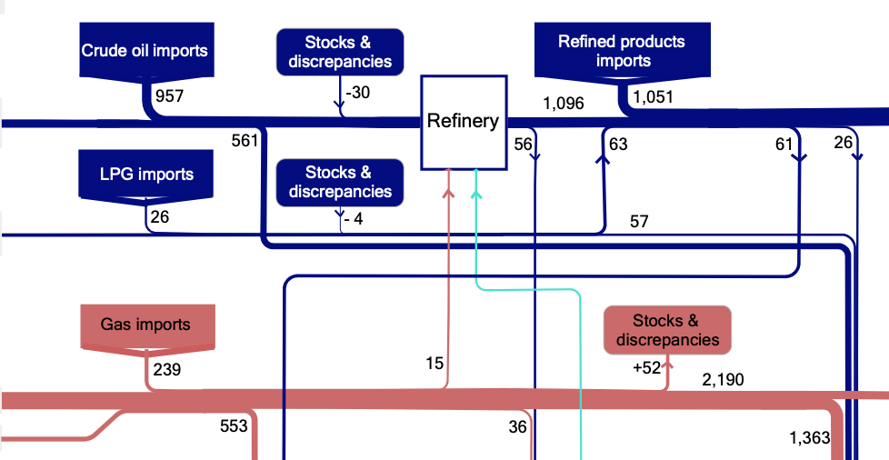

### Show notes

- Australia is very much [still on fire](https://www.reddit.com/r/australia/comments/exhkhw/view_from_conder_canberra_act_last_night/).
- ...as is the Bridget McKenzie scandal. Some nice [color-coded spreadsheets](https://www.abc.net.au/news/2020-01-29/sports-clubs-denied-funding-sports-australia-grants-want-answers/11907988) leaked.
- an hour after we wrapped recoding, Bridget McKenzie [resigned](https://mobile.abc.net.au/news/2020-02-02/bridget-mckenzie-quits-over-ministerial-standards-breach/11896610) from the front bench (but still keeps her seat).
- Leigh Sales from ABC's 7:30 Report [empty-chair interviewed](https://twitter.com/abc730/status/1222802201719926784) McKenzie. Thanks for listening to the show, Leigh!
- Kristina Keneally is running to the right of the Liberal party by complaining about ["airplane people"](https://twitter.com/KKeneally/status/1221909575374270464). She's been [doing it for a while](https://www.sbs.com.au/news/people-smugglers-evolved-from-using-boats-to-planes-under-dutton-keneally).
- Australia is [closing it's borders](https://www.bbc.com/news/world-51338899) to anyone from China (except for citizens and residents), including thousands of students returning for university.

- Scott Morrison [speaks at the press club](https://www.pm.gov.au/media/address-national-press-club)
- BTW, the press club is sponsored by [Westpac](https://www.smh.com.au/business/banking-and-finance/the-banking-royal-commission-has-failed-westpac-is-proof-20191128-p53f38.html)
- Morrison is [forcing New South Wales to use more gas](https://www.theguardian.com/australia-news/2020/jan/31/australian-prime-minister-scott-morrison-strikes-2bn-deal-with-gladys-berejiklian-nsw-to-boost-gas-supply).
- Australia is the world's [biggest exporter of gas](https://www.climatecouncil.org.au/australia-worlds-largest-gas-exporter/)
- ... but we also [import gas](https://www.theguardian.com/australia-news/commentisfree/2019/oct/22/australian-plans-to-import-gas-are-expensive-bad-for-the-climate-and-utterly-absurd).
- We make a pittance from [taxes on gas](https://www.news.com.au/finance/business/mining/tax-and-royalty-systems-for-australias-gas-and-oil-industries-need-reform-experts-argue/news-story/a900c328f1a01bf4e3aee8b867138262). Qatar makes $26 billion in gas taxes. Australia makes $600 million. The oil and gas companies are making off with the rest.
- Corruption drives climate change. We’ve known about this stuff a long time, and it’s [been covered up](https://www.theguardian.com/environment/climate-consensus-97-per-cent/2018/sep/19/shell-and-exxons-secret-1980s-climate-change-warnings).
- Angus Taylor [hates wind farms](https://reneweconomy.com.au/morrison-names-leading-anti-wind-campaigner-as-energy-minister-49560/), and is the minister in charge of all this mess.
- The government is also trying to [tie funding for renewables](https://www.theage.com.au/national/victoria/state-onshore-gas-ban-a-federal-deal-breaker-20200131-p53wnu.html) to new gas plants in Victoria.
- Gas is bad for the environment too. It looks clean, but [leakage in production and transport](https://gisera.csiro.au/factsheet/fugitive-methane-emissions-factsheet/) means it is as bad as coal.
- Like clean coal, [gas is a dead end](https://www.theguardian.com/commentisfree/2020/feb/01/scott-morrison-is-stuck-in-a-time-warp-more-gas-is-not-the-answer). Just build renewables.

### Action items

- [Move your superannuation and bank](https://www.marketforces.org.au) to a fund that doesn't support extractive industries
- Change your [electricity provider](https://www.greenelectricityguide.org.au) and buy renewable energy
- Subscribe to the [Heated newsletter](https://heated.world) for more climate change news
- Listen to the [7am Podcast](https://7ampodcast.com.au/episodes/sports-grants-are-the-tip-of-the-iceberg). Solidaritus et podcastus ✊
