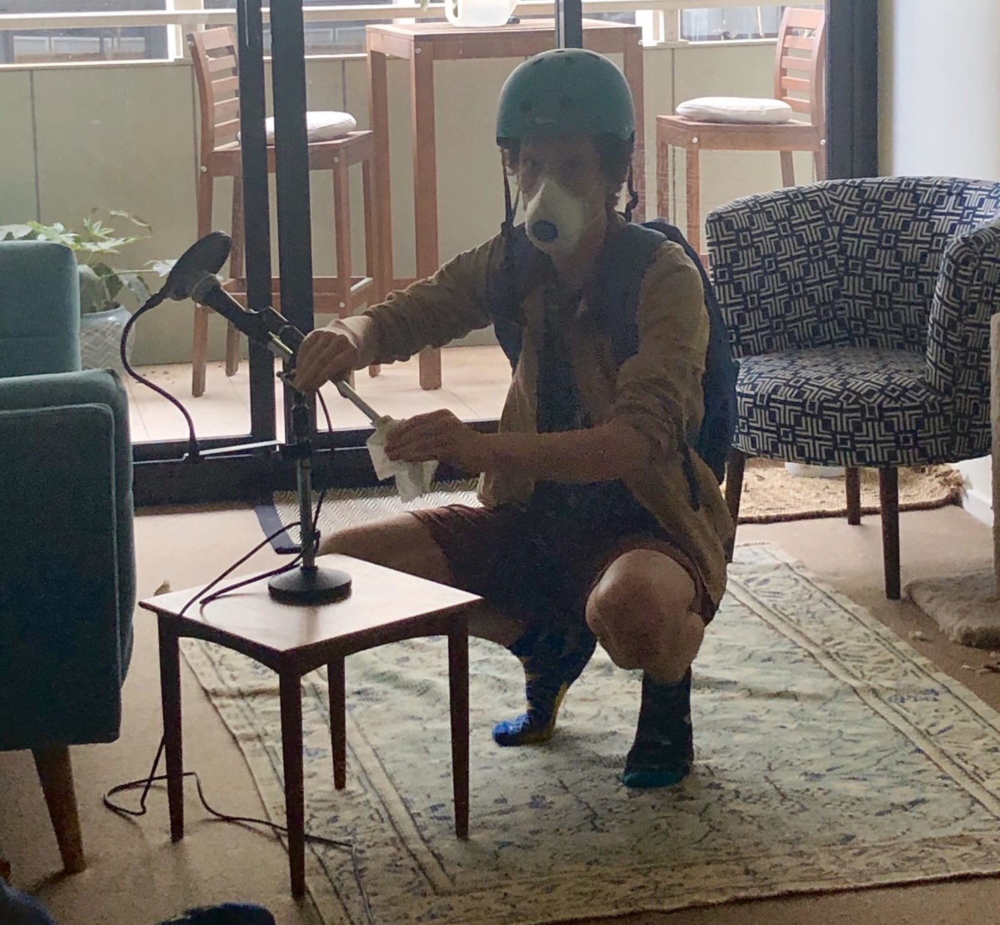

### Policing

- New South Wales Police Minister David Elliot is under investigation after the release of [photos showing him firing and illegal submachine gun](https://www.abc.net.au/news/2020-03-09/nsw-police-minister-david-elliott-fires-submachine-gun-at-range/12040288).
- The Police Minister has previously said he [would want his own underage sons strip-searched](https://www.smh.com.au/national/nsw/minister-would-want-sons-strip-searched-if-at-risk-of-doing-something-wrong-20191106-p537ww.html) by police if they were suspected of possessing drugs.
- New South Wales Police are complicit in a [regime of strip searches](https://www.theguardian.com/australia-news/2020/feb/06/strip-search-inquiry-cut-short-after-nsw-government-sacks-commissioner) of [underage children and teens](https://www.theguardian.com/australia-news/2019/oct/21/police-strip-searched-16-year-old-girl-at-splendour-music-festival-inquiry-hears), without appropriate support or presence of legal guardians.
- Constable Zachary Rolfe, charged with the murder of Yuendumu teenager Kumanjayi Walker, [has not spent a single night in jail](https://www.abc.net.au/news/2020-03-08/yuendumu-residents-question-grant-of-bail-to-zachary-rolfe/12035990).
- For an example of how community policing can work in practice, see the example of the [1960s Black Panther Party](https://www.wglt.org/post/director-chronicles-black-panthers-rise-new-tactics-were-needed).

### Coronavirus

- The Australian Grand Prix was [canceled, at the last minute, via megaphone](https://www.abc.net.au/news/2020-03-13/australian-formula-1-grand-prix-cancelled-over-coronavirus/12052142).
- Home Affairs Minister [Peter Dutton has coronavirus](https://7news.com.au/lifestyle/health-wellbeing/dutton-was-not-infectious-in-washington-c-744948).
- Airlines are [running empty flights](https://www.businessinsider.fr/us/coronavirus-airlines-run-empty-ghost-flights-planes-passengers-outbreak-covid-2020-3) to maintain their flight slots.
- Traveling in a [long-distance, fully loaded flight is more efficient than driving](https://www.thoughtco.com/flying-driving-which-better-for-environment-1203936).
- Guardian columnist Brigid Delaney [enjoyed Bankok under lockdown](https://www.theguardian.com/commentisfree/2020/mar/06/travelling-through-asia-during-the-coronavirus-its-like-i-have-the-whole-place-to-myself), then was surprised to find herself [under self-isolation on return](https://www.theguardian.com/commentisfree/2020/mar/13/i-dont-have-it-my-week-of-not-being-sick-with-coronavirus).
- The ABC has a [dedicated portal for Coronavirus news and information](https://www.abc.net.au/news/story-streams/coronavirus/).

### Surviving the pandemic

- The [median income in Australia is $48,000](https://www.abc.net.au/news/2019-12-30/are-you-one-of-the-average-australians-politicians-refer-to/11831700). Many of the people earning that or less will not be able to afford the costs imposed by other people panic buying staples.
- Industrial Relations Minister Christian Porter has suggested that casual workers without paid sick leave are well prepared for coronavirus because ["they are paid extra in lieu of entitlements"](https://twitter.com/ErykBagshaw/status/1237245658274258945).
- Italy has [suspended mortgage payments](https://www.bbc.com/news/business-51814481) during the coronavirus outbreak.
- An effective response to a dangerous oncoming threat will look like an overreaction in hindsight, as the reaction to the Y2K bug has been incorrectly presented ([the Headlong podcast has a good history of the response](https://www.podbean.com/podcast-detail/9bhdf-4c11f/Headlong-Surviving-Y2K-Podcast)).
- David Walsh's statement on the cancellation of the Dark Mofo festical is an [excellent, clear-eyed assessment of the risks of going forward](https://darkmofo.net.au/statement).

### AAP Closing

- The Australian Associated Press [has been closed](https://www.wsws.org/en/articles/2020/03/09/aapr-m09.html), the majority of journalists laid off.
- Some of the AAP journalists have been re-hired by Nine News and News Corp as freelancers, [saving them money and stopping competitors from accessing their work](https://www.thesaturdaypaper.com.au/news/media/2020/03/14/aap-closure-leaves-industry-reeling/15841044009525).

### Actions

- Look after your friends and family. Make sure the people around you are coping with this new, weird time.
- Check out the [show notes](/010-posting-through-it). They're great!
- Join your union, advocate for them to push for the change you want.
- Join your tenants union ([VIC](https://www.tenantsvic.org.au/), [NSW](https://www.tenants.org.au/tu), [WA](https://www.tenancywa.org.au/), [QLD](https://tenantsqld.org.au/)). They're great for advice on what your rights are as a renter.
- Read [Progress and Poverty by Henry George](https://en.wikipedia.org/wiki/Progress_and_Poverty).
