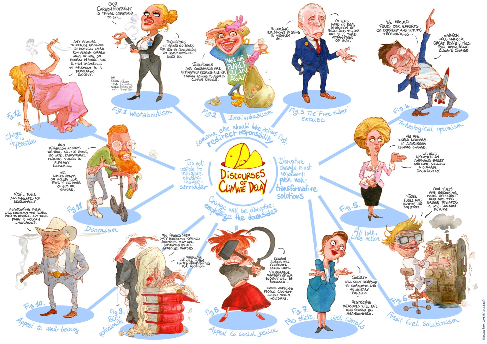
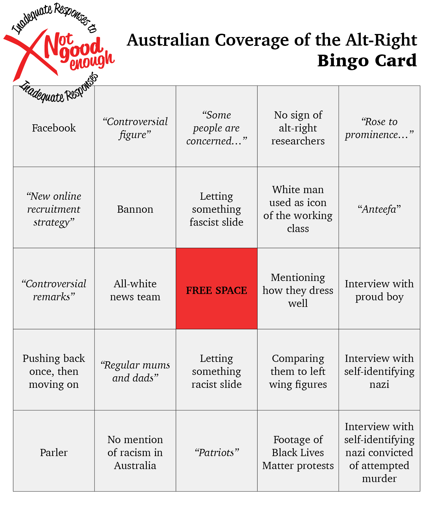

## Clog scandal

- The Netherlands have done a mini-Robodebt, [wrongly accusing thousands of families of abusing a childcare allowance scheme](https://www.theguardian.com/world/2021/jan/14/dutch-government-faces-collapse-over-child-benefits-scandal).
- The entire [Dutch government have "quit" over this scandal](https://www.afr.com/world/europe/entire-dutch-government-resigns-over-child-welfare-scandal-reports-20210116-p56uk0).
- However, they [remain in place in a caretaker capacity](https://www.abc.net.au/news/2021-01-16/dutch-pm-mark-rutte-government-resign-over-tax-subsidy-scandal/13063574). Shades of [Bridget McKenzie's "resignation" here](https://www.theguardian.com/australia-news/2020/feb/02/bridget-mckenzie-resigns-following-sports-rort-affair).

## Climate news

[From @leolinne](https://twitter.com/leolinne/status/1308705832817889284), based on [this paper](https://www.cambridge.org/core/journals/global-sustainability/article/discourses-of-climate-delay/7B11B722E3E3454BB6212378E32985A7).

- The Federal government is [pouring hundreds of millions of dollars of subsidies into gas fracking in the Beetaloo Basin](https://www.abc.net.au/news/2021-01-14/federal-government-road-funding-props-up-beetaloo-development/13057974).
- The gas from the basin is set to emit up to 117 megatonnes of greenhouse gas per year. The entire Australian [transport sector produces about 100 megatonnes](https://www.uow.edu.au/media/2020/transport-is-letting-australia-down-in-the-race-to-cut-emissions.php).

## Farm news

- Farmers in Victoria have [been forced to dump $150,000 worth a celery crops](https://www.abc.net.au/news/rural/2021-01-14/veg-harvest-dumped-in-gippsland-due-to-covid-travel-bans/13056820?fbclid=IwAR17Fh3RSFMjT0pAhqFz61WPikGNTXuOPyn5onapfkPqqrb6SxdnaOhKrCg). 
- International students were [abandoned by the government response to COVID](https://www.theguardian.com/commentisfree/2020/dec/14/australia-wants-international-students-to-study-here-but-abandoned-them-during-the-covid-crisis).
- **Fact check:** Celery is good. A real team player. [Put it in a stir-fry you dummies](https://www.thespruceeats.com/stir-fry-chinese-celery-recipe-695317), or [this fish stew is seriously great](https://www.themediterraneandish.com/sicilian-fish-stew/).

## Sports corner

- The Australian open has been delayed, and is [bringing Coronavirus-positive players and staff into Australia](https://www.theage.com.au/sport/tennis/player-allowed-on-flight-to-melbourne-for-australian-open-despite-positive-test-20210114-p56u45.html).
- [Tennys Sandgren II](https://en.wikipedia.org/wiki/Tennys_Sandgren) [has covid](https://www.theguardian.com/sport/2021/jan/14/us-tennis-player-tennys-sandgren-flying-to-australian-open-despite-positive-covid-test).
- Players are furious after being [forced into hard hotel quarantine](https://www.theage.com.au/sport/tennis/australian-open-quarantine-program-hit-by-two-positive-tests-reports-20210116-p56ulj.html), despite being promised practice time. 
- Premier Dan Andrews [pushed for the Australian Open to remain in Melbourne](https://twitter.com/oz_f/status/1350580092561289216).
- Who remembers last year's Australian Open, [when Slovenian player Dalila Jakupovic due to bushfire smoke](https://www.theguardian.com/sport/2020/jan/14/safety-first-as-australian-open-qualifying-delayed-due-to-poor-air-quality)?

## Michael McCormack watch

- [Scott Morrison is on holiday](https://www.themandarin.com.au/147519-morrison-holiday-pm/), leaving real man and [Nationals Leader Michael McCormack in charge](https://www.theguardian.com/commentisfree/2021/jan/12/in-less-than-a-week-as-acting-pm-michael-mccormack-has-given-conservatives-a-licence-to-lie).
- First, he [equated the US Capitol riots to Black Lives Matter](https://twitter.com/JoshButler/status/1348437183972007937).
- Then [he doubled down](https://twitter.com/BreakfastNews/status/1348728887669256192?s=20), dropping an ["All Lives Matter"](https://twitter.com/thejimmalo/status/1348879502722519041).
- During the 2020 Black Lives Matter protests, [One Nation Senator Pauline Hanson attempted to introduce a motion that "All Lives Matter"](https://www.theguardian.com/australia-news/2020/jun/11/senators-unite-to-block-pauline-hansons-all-lives-matter-motion).
- Australia [doesn't have a right to free speech](https://www.ag.gov.au/rights-and-protections/human-rights-and-anti-discrimination/human-rights-scrutiny/public-sector-guidance-sheets/right-freedom-opinion-and-expression).
- [McCormack also defended](https://twitter.com/JamesEltonPym/status/1348488055934443521) George ["Unusually Complex Online Presence"](https://www.smh.com.au/politics/federal/the-hypocrisy-made-me-sick-turnbull-reveals-details-about-christensen-afp-probe-20200416-p54kfg.html) Christenson.
- Read Jeff Sparrow's [article on the rise of Australia's far-right](https://www.theguardian.com/commentisfree/2021/jan/12/australian-conservatives-go-to-extraordinary-lengths-to-deny-the-reality-of-rightwing-extremism).

## Actions

- Shoutout to Quantas workers and their unions, [fighting back against the airline for underpayment and abuses of the Jobkeeper scheme](https://www.abc.net.au/news/2021-01-13/unions-take-qantas-to-high-court-jobkeeper-allege-wage-theft/13051884).
- Keep an eye on the Australian media coverage of the US Capitol riots, and complete our bingo card.
- Attend the [Invasion Day rallies around Australia](https://www.facebook.com/events/157449042845463/).

 